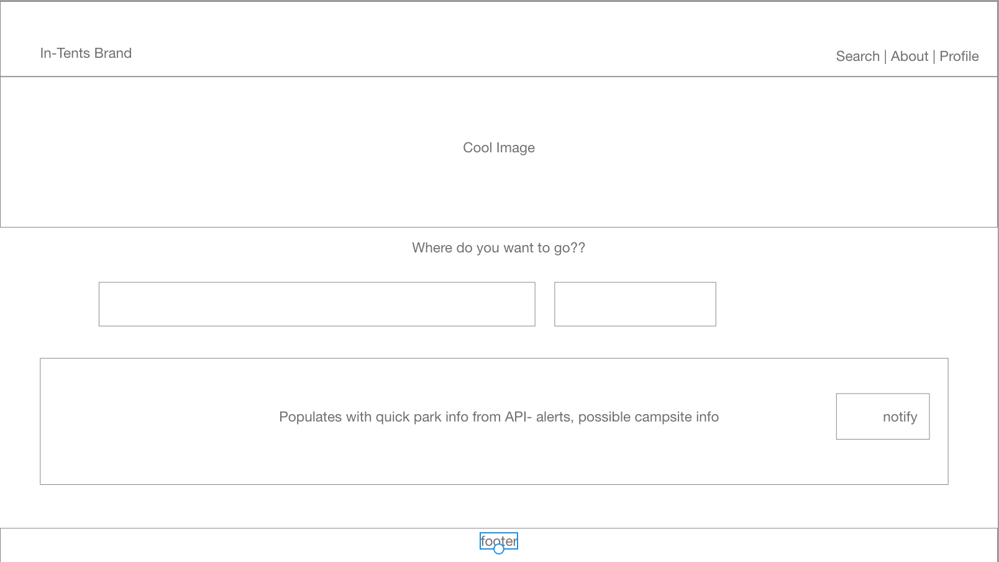

# Project 3: In-Tents

## Goal
The goal of the project is to provide a resource where adventurers of all kinds can search for national parks to get up to date park information and receive alters for changes to park, trail, or campground availability.

## MVP
* User Authentication 
* Ability to search National Park general info.
* User is notified of park alerts
* Search paramenters and responses are logged in database.

## Technologies used
* React
* Node and Express web server
* GET & POST routes
* Mongo database
* NPS APIs
* Heroku for site deployment

## Website Link

[In-Tents](https://banana-cake-18419.herokuapp.com/)

## Mock ups

